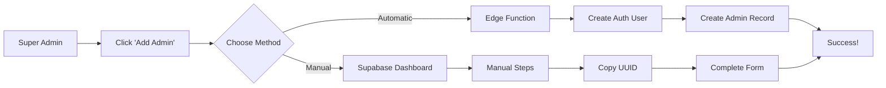

# Deploy Edge Function for Automatic Admin Creation

## 🚀 **Quick Setup Guide**

To enable **automatic admin creation** (bypassing manual Supabase Dashboard steps), you need to deploy the Edge Function.

### ⚡ **Prerequisites**

1. **Supabase CLI installed**:
   ```bash
   npm install -g supabase
   ```

2. **Login to Supabase**:
   ```bash
   supabase login
   ```

3. **Link your project**:
   ```bash
   supabase link --project-ref your-project-id
   ```

### 📁 **File Structure Setup**

Create the following structure in your project root:
```
your-project/
├── supabase/
│   └── functions/
│       └── create-admin-user/
│           └── index.ts
└── ... (your Flutter app files)
```

### 🚀 **Deploy the Function**

1. **Navigate to your project root**:
   ```bash
   cd your-project-directory
   ```

2. **Deploy the functions**:
   ```bash
   # Deploy admin creation function
   supabase functions deploy create-admin-user
   
   # Deploy admin deletion function (optional)
   supabase functions deploy delete-admin-user
   ```

3. **Verify deployment**:
   ```bash
   supabase functions list
   ```

### 🔄 **Redeploy After Updates**

If you made changes to fix authorization issues:

```bash
# Redeploy both functions
supabase functions deploy create-admin-user
supabase functions deploy delete-admin-user

# Check deployment status
supabase functions list
```

### 🔐 **Set Environment Variables**

The function needs these environment variables (automatically available in Supabase):
- `SUPABASE_URL` ✅ (auto-configured)
- `SUPABASE_ANON_KEY` ✅ (auto-configured)  
- `SUPABASE_SERVICE_ROLE_KEY` ✅ (auto-configured)

### ✅ **Test the Deployment**

After deployment, test that everything works:

1. **Login as super admin** in your Flutter app
2. **Go to super admin dashboard** (`/super-admin`)
3. **Click "إضافة مسؤول جديد"** (Add New Admin)
4. **Select "إنشاء تلقائي"** (Automatic Creation)
5. **Fill the form** and click "إنشاء تلقائي"

If successful, you should see the new admin created without any manual steps!

## 🔧 **Advanced Configuration**

### 🛡️ **Security Settings**

The Edge Function includes built-in security:
- ✅ **Super Admin Verification**: Only super admins can create new admins
- ✅ **Input Validation**: Validates all required fields
- ✅ **Role Validation**: Ensures valid roles only
- ✅ **Cleanup on Failure**: Removes auth user if admin creation fails

### 📊 **Function Features**

- **Complete User Creation**: Creates both auth user and admin record
- **Auto Email Confirmation**: New users don't need email verification
- **Error Handling**: Proper cleanup if anything goes wrong
- **Audit Trail**: Logs creation metadata
- **CORS Support**: Works with Flutter web apps

### 🔍 **Troubleshooting**

#### **Function Not Found Error**
```bash
# Re-deploy the function
supabase functions deploy create-admin-user --verify-jwt false
```

#### **Permission Denied**
```bash
# Check you're linked to the right project
supabase projects list
supabase link --project-ref YOUR_CORRECT_PROJECT_ID
```

#### **Service Role Key Issues**
The service role key should be automatically available. If issues persist:
1. Go to Supabase Dashboard → Settings → API
2. Verify service role key is generated
3. Re-deploy the function

### 🔄 **Manual Fallback**

If the Edge Function fails to deploy or work, the app automatically falls back to **manual creation mode**:
- Users will see the manual creation form
- Instructions guide them through Supabase Dashboard
- Everything works as before

### 📱 **How It Works**



## 🎉 **Benefits of Edge Function Approach**

✅ **Complete Automation**: No manual Supabase Dashboard steps
✅ **Better UX**: Single form, single click creation  
✅ **Secure**: Server-side execution with service role key
✅ **Reliable**: Automatic cleanup on failures
✅ **Scalable**: Can create multiple admins quickly
✅ **Audit Trail**: Tracks who created what admin

## 📞 **Quick Commands Reference**

```bash
# Deploy function
supabase functions deploy create-admin-user

# Check function logs
supabase functions logs create-admin-user

# List all functions
supabase functions list

# Delete function (if needed)
supabase functions delete create-admin-user
```

Once deployed, your super admins can create new admins instantly without any manual Supabase Dashboard interaction! 🚀 